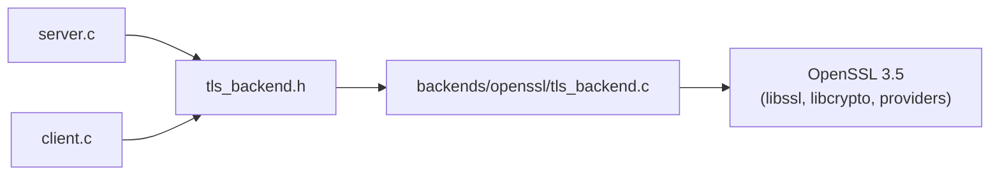
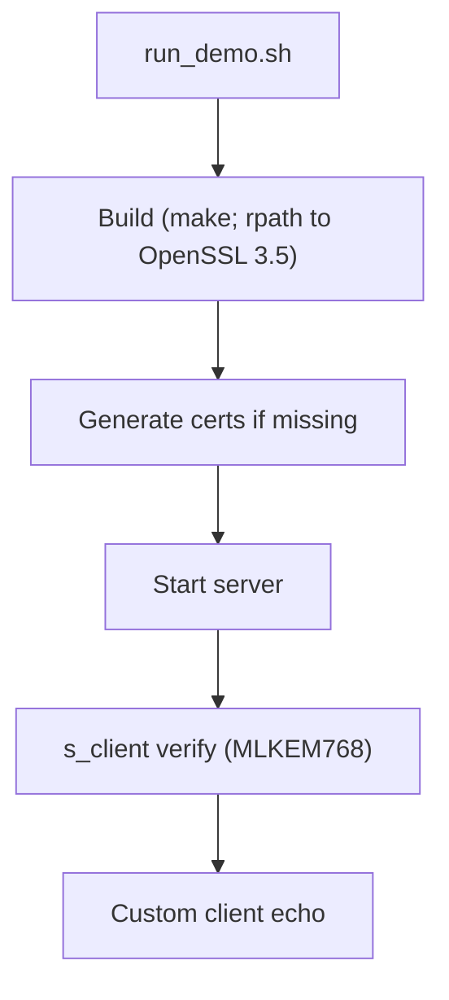

## Module layout

```mermaid
flowchart LR
    A[server.c] --> B[tls_backend.h]
    C[client.c] --> B
    B --> D[backends/openssl/tls_backend.c]
    D --> E["OpenSSL 3.5<br/>(libssl, libcrypto, providers)"]
```
## Build/Run flow

```mermaid
flowchart TB
    R1["run_demo.sh"] --> R2["Build (make; rpath to OpenSSL 3.5)"]
    R2 --> R3["Generate certs if missing"]
    R3 --> R4["Start server"]
    R4 --> R5["s_client verify (MLKEM768)"]
    R5 --> R6["Custom client echo"]
```
